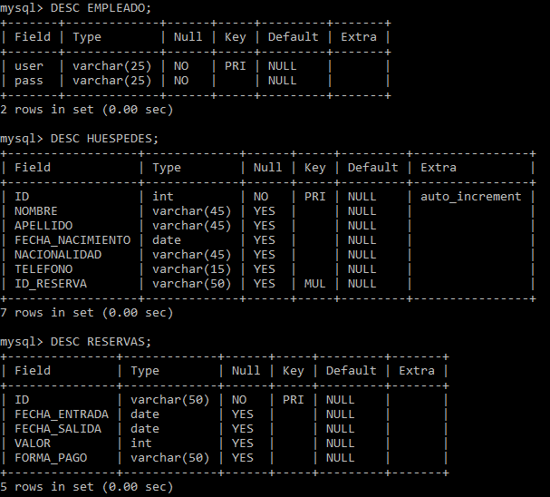
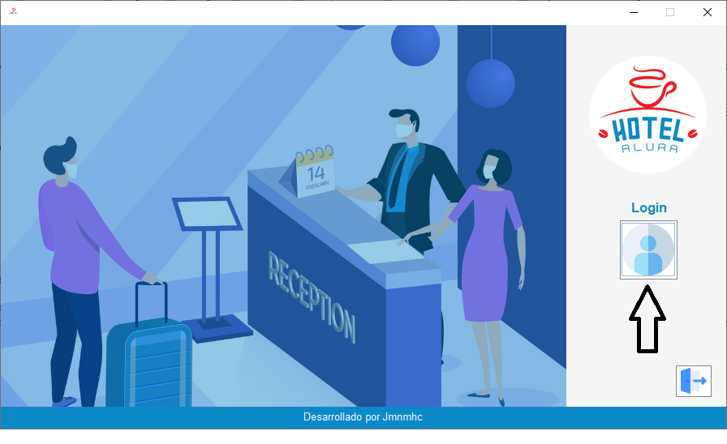
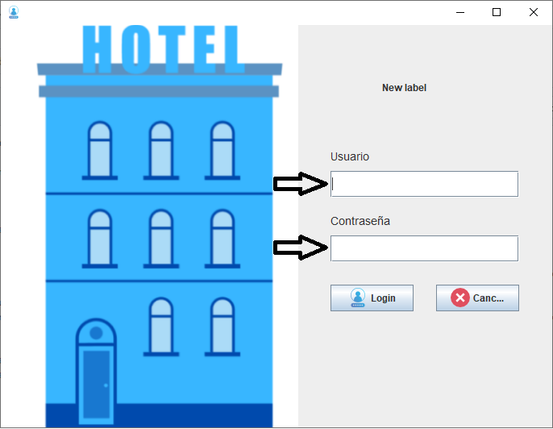
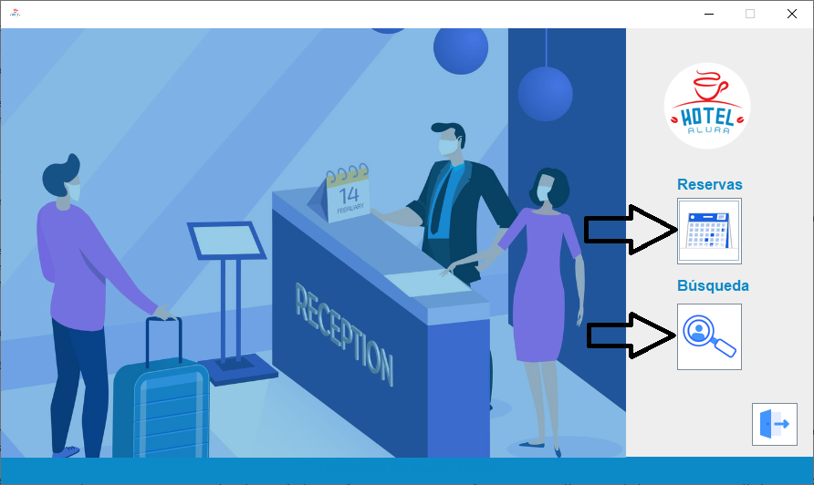
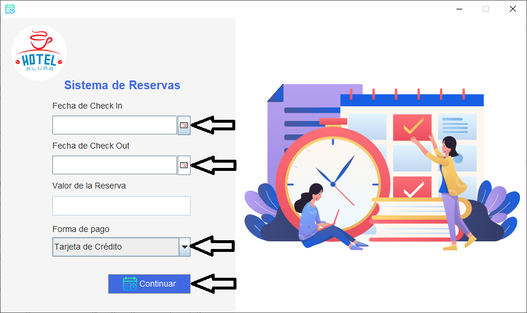
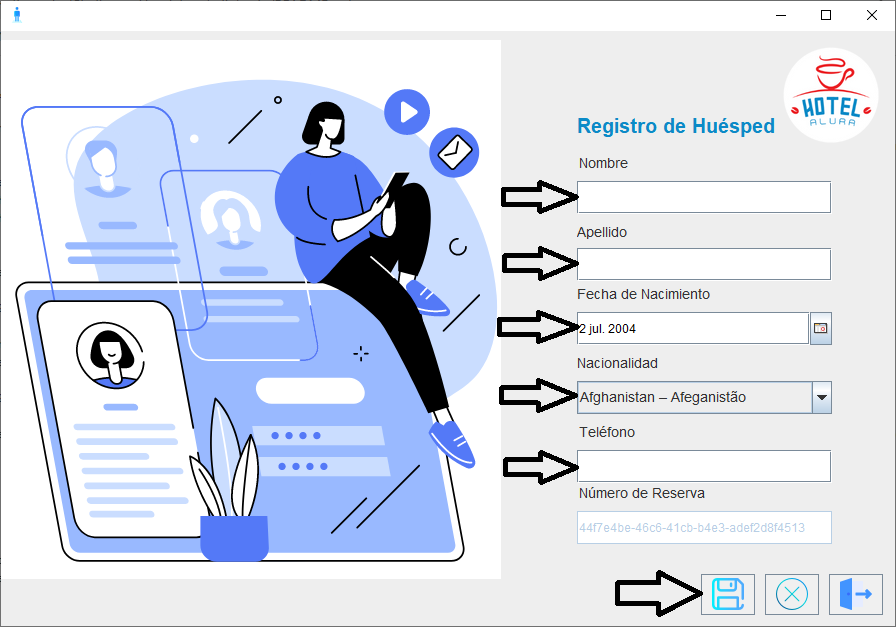
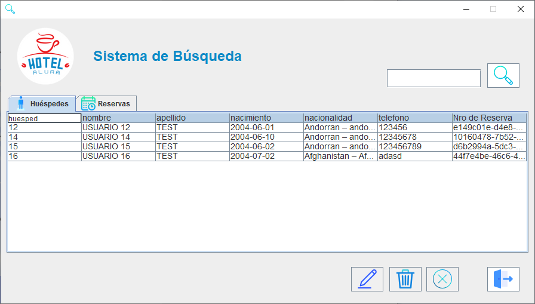

# Challenge ONE | Java | Back-end | Hotel Alura

 El sistema de manejo de habitaciones desarrollado para Hotel Alura parte de la siguiente base de datos realizada en MYSQL

NOMBRE: Hotel_alura

     

Por el momento, el registro de nuevos empleados lo debe realizar alguien del área de Sistemas "manualmente" usando una consulta de mySql.

El programa funciona de la siguiente manera:
en la pantalla principal nos encontramos con el boton login, el que nos abre una ventana en la que deberá ingresarse el usuario y la contraseña previamente asignadas.

     
     

La siguiente pantalla nos deja realizar una nueva reserva o buscar entre los usuarios y reservas previamente realizadas.

 

En el caso de realizar una nueva reserva nos va a pedir la fecha de ingreso, la de egreso, nos va a dar el valor total de la reserva hay que elegir la forma de pago (por defecto es tarjeta de crédito) y luego hay que presionar el boton continuar.

 

En la siguiente ventana nos pide los datos del huesped (nombre, apellido, fecha de nacimiento, nacionalidad (por si hay que efectuar recargos/descuentos dependiendo su origen), fecha de nacimiento, numero de telefono) y nos da el numero de reserva que deberá ser informado al huesped.

 

En la ventana de busqueda nos va a dejar modificar los datos del huesped (no de la reserva) y eliminarlo (eliminandose tambien la reserva). Se podrá buscar huespedes por nombre y reservas por numero de reserva

 

 

